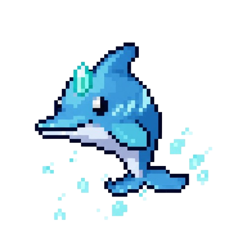

# Genmon

A basic multiplayer browser-based game inspired by the Pokémon franchise.

> Fully generated by AI.

## Running the Application

1. **Install:** If you haven't already, run npm install.

2. **Start Server:** Run npm start or node server.js. You should see logs indicating the server has started.

3. **Open Browser:** Open your web browser and go to [http://localhost:3000](http://localhost:3000).

4. **Move:** Use arrow keys or WASD in one window to move that player. The movement should reflect in both windows.

5. **Battle:** Move the players next to each other and click the "Look for Battle" button in one window. A basic battle should start. Select moves when prompted.

